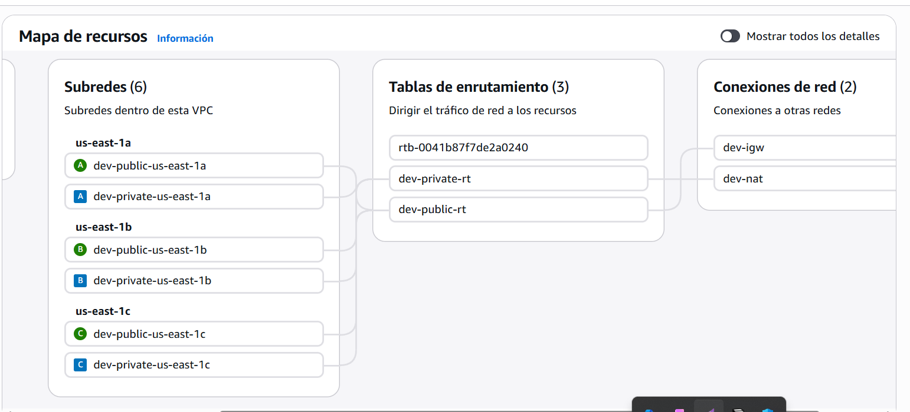
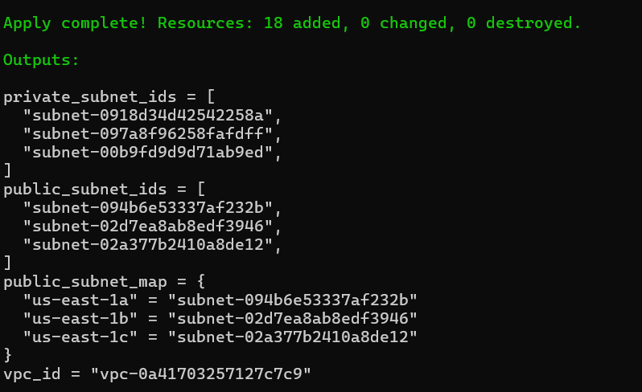

Este repositorio contiene la configuración de Infraestructura como Código (IaC) para desplegar una red robusta y escalable en Amazon Web Services (AWS). El proyecto automatiza la creación de una VPC con segmentación de red en múltiples zonas de disponibilidad.

🎯 Objetivos del Proyecto
Automatización Completa: Despliegue de 18 recursos interconectados con un solo comando.

Alta Disponibilidad: Configuración de subredes distribuidas en las zonas de disponibilidad us-east-1a, us-east-1b y us-east-1c.

Seguridad por Diseño: Segmentación clara entre subredes públicas (con acceso a internet) y subredes privadas.

🏗️ Recursos Desplegados
La ejecución de este código crea:

1 Virtual Private Cloud (VPC): El aislamiento lógico de la red.

3 Subredes Públicas: Mapeadas dinámicamente a diferentes zonas de disponibilidad para balanceo de carga.

3 Subredes Privadas: Para el alojamiento seguro de bases de datos y capas de aplicación.

Componentes de Red: Internet Gateway, Tablas de ruteo y asociaciones necesarias para el tráfico de red.

🛠️ Tecnologías Utilizadas
Terraform (HCL): Para la orquestación y gestión del estado de la infraestructura.

AWS: Cloud Provider donde se alojan los recursos.

Estructura Modular: Uso de archivos separados para vpc.tf, variables.tf, datasources.tf y outputs.tf para mayor mantenibilidad.

## 📸 Visualización de la Infraestructura

El despliegue fue realizado exitosamente, añadiendo 18 recursos sin errores:

